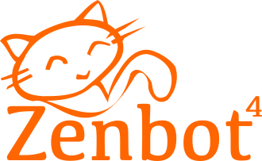

> Um dem Pfad zu folgen: “Schauen Sie zum Meister, folgen Sie dem Meister, gehen Sie mit dem Meister, sehen Sie durch den Meister und werden Sie der Meister.”
> – Zenbot-Sprichwort

# Zenbot  

Diese deutschsprachige Version v4.1.0.1 von Zenbot entspricht der englischen original Version v4.1.0 von [DeviaVir](https://github.com/DeviaVir/zenbot).

## Beschreibung

Zenbot ist ein Befehlszeilenbasierender-Kryptowährungs-Handelsbot, der dazu Node.js und die MongoDB verwendet. Es verfügt über:

- Vollautomatischer, auf technischen Analysen basierender Handelsansatz.
- Mit vollständiger Unterstützung für Binance, Bitfinex, Bitstamp, Bittrex, CEX.IO, GDAX, Gemini, HitBTC, Kraken, Poloniex, QuadrigaCX und TheRockTrading. Und funktioniert mit weiteren diversen Börsen [Exchanges]. Deren vollständige Unterstützung ist allerdings noch nicht abgeschlossen.
- Plugin-Architektur zur Implementierung der Exchangeunterstützung oder zum Schreiben neuer Strategien.
- Simulator für Backtesting-Strategien oder als Zip Backtesting-Strategien oder auf GitHub Backtesting-Strategien gegen historische Daten.
- Der Handelsmodus "Papier" arbeitet mit einem simulierten Kontostand, während Sie den Live-Markt beobachten.
- Konfigurierbare Verkaufsstopps, Kaufstopps und (nachlaufende) Gewinnstopps.
- Flexibler Stichprobenzeitraum und Handelshäufigkeit - durchschnittlich 1-2 Trades/Tag mit 1h Zeitraum, 15-50/Tag mit 5m Zeitraum.

## Haftungsausschluss

- Zenbot is NOT a sure-fire profit machine. Use it AT YOUR OWN RISK.
- Crypto-currency is still an experiment, and therefore so is Zenbot. Meaning, both may fail at any time.
- Running a bot, and trading in general requires careful study of the risks and parameters involved. A wrong setting can cause you a major loss.
- Never leave the bot un-monitored for long periods of time. Zenbot doesn't know when to stop, so be prepared to stop it if too much loss occurs.
- Often times the default trade parameters will underperform vs. a buy-hold strategy, so run some simulations and find the optimal parameters for your chosen exchange/pair before going "all-in".

- Zenbot ist KEINE sichere Gewinnmaschine. Verwendung nur auf eigenes Risiko!
- Kryptowährung ist immer noch ein Experiment, und Zenbot auch. Das heißt, beide können jederzeit fehlschlagen.
- Das Ausführen eines Bots und das Handeln im Allgemeinen erfordern eine sorgfältige Untersuchung, der damit verbundenen Risiken und Parameter. Eine falsche Einstellung kann zu erheblichen Verlusten führen.
- Lassen Sie den Bot niemals eine längere Zeit unbeaufsichtigt. Zenbot weiß nicht, wann er aufhören soll. Seien Sie also bereit dies zu stoppen, wenn zu viel Verlust aufkommt.
- Oft sind die Standard-Handelsparameter im Vergleich zu einer Buy-Hold-Strategie unterdurchschnittlich. Führen Sie daher einige Simulationen durch und finden Sie die optimalen Parameter für die von Ihnen gewählten exchange/pair-Paar (Börse/Währungspaar), bevor Sie "All-in" gehen.

## Dokumentation

Die ausführliche Dokumentation befindet sich im docs-Ordner oder auf GitHub [docs-folder](docs/)-Ordner. .

### Fragen

Schauen Sie sich zuerst die [docs](docs/)-Dokumente an und es gibt auch [FAQs](docs/FAQ.md), die Ihre Fragen beantworten können. Wenn nicht, stellen Sie bitte (Programmier-) Fragen in Englischer Sprache zu Zenbot auf Reddit ([subreddit zenbot](https://reddit.com/r/zenbot)).

### Gemeinschaft

Treten Sie der [Zenbot-Community auf Reddit](https://reddit.com/r/zenbot) in Englischer Sprache bei!

## Spenden

PS: Einige haben gefragt, wie sie für die Zenbot-Entwicklung spenden können. Wir akzeptieren Spenden an die folgenden **Bitcoin-Adressen**:

### carlos8f's BTC (ursprünglicher Zenbot-Autor)

`187rmNSkSvehgcKpBunre6a5wA5hQQop6W`

### DeviaVir's BTC (aktueller Betreuer)

`3A5g4GQ2vmjNcnEschCweJJB4umzu66sdY`

Thanks!

## Bemerkenswerte Forks (Gabelungen)

- [bot18](https://medium.com/@carlos8f_11468/introducing-bot18-the-new-crypto-trading-bot-to-supersede-zenbot-and-unleash-the-zalgo-da8464b41e53)
- [magic8bot](https://github.com/notVitaliy/magic8bot)

- - -

## Lizenz: MIT

- Copyright (C) 2018 Carlos Rodriguez
- Copyright (C) 2018 Terra Eclipse, Inc. (http://www.terraeclipse.com/)

Hiermit wird jeder Person, die eine Kopie dieser Software und der zugehörigen Dokumentationsdateien (die &quot;Software&quot;) erhält, kostenlos die Erlaubnis erteilt, uneingeschränkt mit der Software umzugehen. 
Einschließlich, jedoch nicht beschränkt auf die Rechte zur Nutzung, zum Kopieren, Ändern, Zusammenführen, veröffentlichen, vertreiben, unterlizenzieren und/oder verkaufen Kopien der Software und erlaubten Personen, denen die Software zur Verfügung gestellt wird, dies unter den folgenden Bedingungen: 

Der obige Urheberrechtshinweis und dieser Erlaubnishinweis sind in allen Kopien oder wesentlichen Teilen der Software enthalten.

DIE SOFTWARE WIRD &quot;WIE GESEHEN&quot; OHNE JEGLICHE AUSDRÜCKLICHE ODER STILLSCHWEIGENDE GEWÄHRLEISTUNG ZUR VERFÜGUNG GESTELLT. 
EINSCHLIESSLICH DER GEWÄHRLEISTUNG FÜR MARKTGÄNGIGKEIT, EIGNUNG FÜR EINEN BESTIMMTEN ZWECK UND NICHTVERLETZUNG. 
IN KEINEM FALL HAFTEN DIE AUTOREN ODER COPYRIGHT-INHABER FÜR JEGLICHE ANSPRÜCHE, SCHÄDEN ODER ANDERE HAFTUNGEN, OB VERTRAGS-, TORT- ODER ANDERWEITIGE MASSNAHMEN AUS, AUS ODER IM ZUSAMMENHANG MIT DER SOFTWARE ODER DER NUTZUNG ODER ANDEREN ANGEBOTE SOFTWARE.
