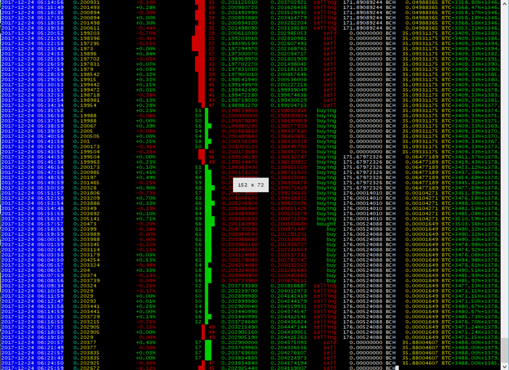

```sudo ./zenbot.sh sim --strategy=trendline --period=1s --min_periods=15000 --days=14 poloniex.BCN-BTC```

### Ubuntu 16.04 Step-By-Step
https://youtu.be/BEhU55W9pBI
```
sudo apt-get update
sudo apt-get upgrade -y
sudo apt-get install build-essential mongodb -y

curl -sL https://deb.nodesource.com/setup_8.x | sudo -E bash -
sudo apt-get install -y nodejs

git clone https://github.com/carlos8f/zenbot.git
cd zenbot
npm install

./zenbot.sh trade --paper
```
## Selectors

A "selector" is a short identifier that tells Zenbot which exchange and currency pair to act on. Use the form `{exchange_slug}.{asset}-{currency}`. A complete list of selectors your Zenbot install supports can be found with:

```
zenbot list-selectors

poloniex:
  poloniex.AMP-BTC   (Synereo AMP/BTC)
  poloniex.ARDR-BTC   (Ardor/BTC)
  poloniex.BCN-BTC   (Bytecoin/BTC)
  poloniex.BCN-XMR   (Bytecoin/XMR)
  poloniex.BCY-BTC   (BitCrystals/BTC)
```

## Run a simulation for your selector

To backfill data (provided that your chosen exchange supports it), use:

```
zenbot backfill <selector> --days <days>
```

After you've backfilled, you can run a simulation:

```
zenbot sim <selector> [options]
```

For a list of options for the `sim` command, use:

```
zenbot sim --help

```

For additional options related to the strategy, use:

```
zenbot list-strategies
```

- By default the sim will start with 1000 units of currency. Override with `--currency_capital` and `--asset_capital`.
- Open `sim_result.html` in your browser to see a candlestick graph with trades.

### Screenshot and example result

Zenbot outputs an HTML graph of each simulation result. In the screenshot below, the pink arrows represent the bot buying (up arrow) and selling (down arrow) as it iterated the historical data of [GDAX](https://gdax.com/) exchange's BTC/USD product.


```
end balance 2954.50 (195.45%)
buy hold 1834.44 (83.44%)
vs. buy hold 61.06%
110 trades over 91 days (avg 1.21 trades/day)
```

Zenbot started with $1,000 USD and ended with $2,954.50 after 90 days, making 195% ROI! In spite of a buy/hold strategy returning a respectable 83.44%, Zenbot has considerable potential for beating buy/holders.

- Note that this example used tweaked settings to achieve optimal return: `--profit_stop_enable_pct=10`, `--profit_stop_pct=4`, `--trend_ema=36`, and `--sell_rate=-0.006`. Default parameters yielded around 65% ROI.
- [Raw data](https://gist.github.com/carlos8f/b09a734cf626ffb9bb3bcb1ca35f3db4) from simulation

## Running zenbot

The following command will launch the bot, and if you haven't touched `c.selector` in `conf.js`, will trade the default BTC/USD pair on GDAX.

```
zenbot trade [--paper] [--manual]
```

Use the `--paper` flag to only perform simulated trades while watching the market.

Use the `--manual` flag to watch the price and account balance, but do not perform trades automatically.

Here's how to run a different selector (example: ETH-BTC on Poloniex):

```
zenbot trade poloniex.eth-btc
```

For a full list of options for the `trade` command, use:

```
zenbot trade --help

  Usage: trade [options] [selector]

  run trading bot against live market data

  Options:

    --conf <path>                   path to optional conf overrides file
    --strategy <name>               strategy to use
    --order_type <type>             order type to use (maker/taker)
    --paper                         use paper trading mode (no real trades will take place)
    --manual                        watch price and account balance, but do not perform trades automatically
    --currency_capital <amount>     for paper trading, amount of start capital in currency
    --asset_capital <amount>        for paper trading, amount of start capital in asset
    --avg_slippage_pct <pct>        avg. amount of slippage to apply to paper trades
    --buy_pct <pct>                 buy with this % of currency balance
    --sell_pct <pct>                sell with this % of asset balance
    --markdown_buy_pct <pct>        % to mark down buy price (previously the --markup_pct property)
    --markup_sell_pct <pct>         % to mark up sell price (previously the --markup_pct property)
    --order_adjust_time <ms>        adjust bid/ask on this interval to keep orders competitive
    --order_poll_time <ms>          poll order status on this interval
    --sell_stop_pct <pct>           sell if price drops below this % of bought price
    --buy_stop_pct <pct>            buy if price surges above this % of sold price
    --profit_stop_enable_pct <pct>  enable trailing sell stop when reaching this % profit
    --profit_stop_pct <pct>         maintain a trailing stop this % below the high-water mark of profit
    --max_sell_loss_pct <pct>       avoid selling at a loss pct under this float
    --max_slippage_pct <pct>        avoid selling at a slippage pct above this float
    --rsi_periods <periods>         number of periods to calculate RSI at
    --poll_trades <ms>              poll new trades at this interval in ms
    --disable_stats                 disable printing order stats
    --reset_profit                  start new profit calculation from 0
    --debug                         output detailed debug info
    -h, --help                      output usage information
```

and also:

```
zenbot list-strategies
trendline (default)
  description:
    Calculate a trendline and trade when trend is positive vs negative.
  options:
    --period=<value>  period length (default: 1s)
    --lastpoints=<value>  Number of trades for short trend average (default: 100)
    --avgpoints=<value>  Number of trades for long trend average (default: 1000)
    --lastpoints2=<value>  Number of trades for short trend average (default: 10)
    --avgpoints2=<value>  Number of trades for long trend average (default: 100)
    --min_periods=<value>  Basically avgpoints + a BUNCH of more preroll periods for anything less than 5s period (default: 5000)
    --markup_sell_pct=<value>  test (default: 0)
    --markdown_buy_pct=<value>  test (default: 0)

## Interactive controls

While the `trade` command is running, Zenbot will respond to these keypress commands:

- Pressing `b` will trigger a buy, `s` for sell, and `B` and `S` for market (taker) orders.
- Pressing `c` or `C` will cancel any active orders.
- Pressing `m` or `M` will toggle manual mode (`--manual`)

These commands can be used to override what the bot is doing. Or, while running with the `--manual` flag, this allows you to make all the trade decisions yourself.

## Conf/argument override files

To run `trade` or `sim` commands with a pre-defined set of options, use:

```
zenbot trade --conf <path>
```

Where `<path>` points to a JS file that exports an object hash that overrides any conf or argument variables. For example, this file will run gdax.ETH-USD with options specific for that market:

```
var c = module.exports = {}

// ETH settings (note: this is just an example, not necessarily recommended)
c.selector = 'gdax.ETH-USD'
c.period = '10m'
c.trend_ema = 20
c.neutral_rate = 0.1
c.oversold_rsi_periods = 20
c.max_slippage_pct = 10
c.order_adjust_time = 10000
```

## Reading the console output


From left to right:

- Timestamp in local time (grey, blue when showing "live" stats)
- Asset price in currency (yellow)
- Percent change of price since last period (red/green)
- Volume in asset since last period (grey)
- [RSI](http://stockcharts.com/school/doku.php?id=chart_school:technical_indicators:relative_strength_index_rsi) ANSI graph (red/green)
- `trend_ema_rate` (red/green, explained below)
- Current signal or action, including `buy`, `sell`, `buying`, `selling`, `bought`, `sold` and `last_trade_worth` (percent change in the trend direction since last buy/sell)
- Account balance (asset)
- Account balance (currency)
- Profit or loss percent (can be reset with `--reset_profit`)
- Gain or loss vs. buy/hold strategy

## Notifiers

Zenbot employs various notifiers to keep you up to date on the bot's actions. We currently send a notification on a buy and on a sell signal.

### pushbullet

Supply zenbot with your api key and device ID and we will send your notifications to your device.
https://www.pushbullet.com/

### Slack

Supply zenbot with a webhook URI and zenbot will push notifications to your webhook.
https://slack.com/

### XMPP

Supply zenbot with your XMPP credentials and zenbot will send notifications by connecting to your XMPP, sending the notification, and disconnecting.
https://xmpp.org/

### IFTTT

Supply zenbot with your IFTTT maker key and zenbot will push notifications to your IFTTT.
https://ifttt.com/maker_webhooks

### DISCORD

Supply zenbot with your Discord webhook id and webhook token zenbot will push notifications to your Discord channel.

How to add a webhook to a Discord channel
https://support.discordapp.com/hc/en-us/articles/228383668

### Prowl

Supply zenbot with your Prowl API key and zenbot will push notifications to your Prowl enabled devices.
https://www.prowlapp.com/

### TextBelt

Supply zenbot with your TextBelt API key and zenbot will send SMS notifications to your cell phone.
https://www.textbelt.com/

## Rest API

You can enable a Rest API for Zenbot by enabling the following configuration
```
c.output.api = {}
c.output.api.on = true
c.output.api.port = 0 // 0 = random port
```
You can choose a port, or pick 0 for a random port.

Once you did that, you can call the API on: http://\<hostname\>:\<port\>/trades

## Manual trade tools

Zenbot's order execution engine can also be used for manual trades. Benefits include:

- Avoids market-order fees by using a short-term limit order
- Can automatically determine order size from account balance
- Adjusts order every 30s (if needed) to ensure quick execution
- If an order is partially filled, attempts to re-order with remaining size

The command to buy is:

```
zenbot buy <selector> [--size=<size>] [--pct=<pct>]
```

For example, to use your remaining USD balance in GDAX to buy Bitcoin:

```
zenbot buy gdax.BTC-USD
```

Or to sell 10% of your BTC,

```
zenbot sell gdax.BTC-USD --pct=10
```

## Chat with other Zenbot users

[](https://discord.gg/ZdAd2gP)

Zenbot has a Discord chat! You can get in [through this invite link](https://discord.gg/ZdAd2gP).

## Donate

P.S., some have asked for how to donate to Zenbot development. I accept donations at **my Bitcoin address** Here:

### carlos8f's BTC

`187rmNSkSvehgcKpBunre6a5wA5hQQop6W`


Thanks!

- - -

### License: MIT

- Copyright (C) 2017 Carlos Rodriguez
- Copyright (C) 2017 Terra Eclipse, Inc. (http://www.terraeclipse.com/)

Permission is hereby granted, free of charge, to any person obtaining a copy
of this software and associated documentation files (the &quot;Software&quot;), to deal
in the Software without restriction, including without limitation the rights
to use, copy, modify, merge, publish, distribute, sublicense, and/or sell
copies of the Software, and to permit persons to whom the Software is furnished
to do so, subject to the following conditions:

The above copyright notice and this permission notice shall be included in
all copies or substantial portions of the Software.

THE SOFTWARE IS PROVIDED &quot;AS IS&quot;, WITHOUT WARRANTY OF ANY KIND, EXPRESS OR
IMPLIED, INCLUDING BUT NOT LIMITED TO THE WARRANTIES OF MERCHANTABILITY,
FITNESS FOR A PARTICULAR PURPOSE AND NONINFRINGEMENT. IN NO EVENT SHALL THE
AUTHORS OR COPYRIGHT HOLDERS BE LIABLE FOR ANY CLAIM, DAMAGES OR OTHER
LIABILITY, WHETHER IN AN ACTION OF CONTRACT, TORT OR OTHERWISE, ARISING FROM,
OUT OF OR IN CONNECTION WITH THE SOFTWARE OR THE USE OR OTHER DEALINGS IN THE
SOFTWARE.
