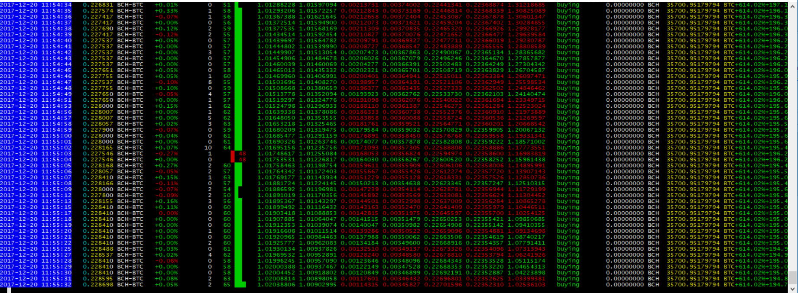

## Lesen der Konsolenausgabe



Von links nach rechts (für die oben nicht abgebildete Trendlinie, die neuronal ist):

- Zeitstempel in Ortszeit (grau, blau, wenn "Live" -Statistiken angezeigt werden)
- Vermögenspreis in Währung (gelb)
- Prozentuale Preisänderung seit dem letzten Zeitraum (rot/grün)
- Volumen des Vermögenswerts seit der letzten Periode (grau)
- [RSI](http://stockcharts.com/school/doku.php?id=chart_school:technical_indicators:relative_strength_index_rsi) ANSI-Diagramm (rot/grün)
- Strategieinformationen in der Reihenfolge:
```
- col1: trendline 10000/1000 trades 
- col2: trendline 1000/100 trades 
- col3:stdev of 10000 trades
- col4: stdev of 1000 trades
- col5: 10000trades mean
- col6: 1000 trades mean
- col7: Der Mittelwert der 10000 & 1000-Trades und stdev berechnet in 100 * der stdev-Prozentsatz des Mittelwerts der Long- und Short-Trades (kurz das aktive Markup basierend auf einem Multiplikator, um einen Prozentsatz der Standardabweichung zu erstellen.) 
- Wenn die vier Spalten rechts grün sind, bedeutet dies, dass der Trend derzeit zunimmt.) Wenn beide links grün sind, nehmen beide Trends zu.)
```
- Aktuelles Signal oder Aktion, einschließlich `buy`, `Kaufen`, `Verkaufen`, `Kaufen`, `Verkaufen`, `Verkauft` und `last_trade_worth` (prozentuale Änderung der Trendrichtung seit dem letzten Kauf/Verkauf)
- Aktuelles Signal oder Aktion, einschließlich `buy`, `sell`, `buying`, `selling`, `bought`, `sold` und `last_trade_worth` (prozentuale Änderung der Trendrichtung seit dem letzten Kauf/Verkauf)
- Kontostand (Vermögenswert)
- Kontostand (Währung)
- Gewinn- oder Verlustprozentsatz (kann mit `--reset_profit` zurückgesetzt werden)
- Gewinn oder Verlust gegenüber der Buy/Hold-Strategie

