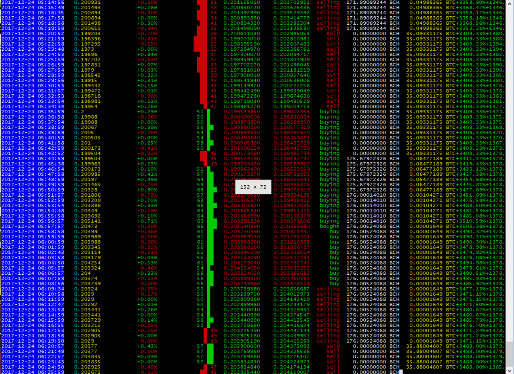

## Reading the console output



From left to right ( for trendline not pictured above, which is neural ):

- Timestamp in local time (grey, blue when showing "live" stats)
- Asset price in currency (yellow)
- Percent change of price since last period (red/green)
- Volume in asset since last period (grey)
- [RSI](http://stockcharts.com/school/doku.php?id=chart_school:technical_indicators:relative_strength_index_rsi) ANSI graph (red/green)
- strategy inormation, in order:
```
- col1: current last trade price
- col2: The old trade last trade price averaged with the prediction. 
- If the predicted price and average of last trade price exceeds the current last trade price, then buy.. Like a neural-trendline.
```
- Current signal or action, including `buy`, `sell`, `buying`, `selling`, `bought`, `sold` and `last_trade_worth` (percent change in the trend direction since last buy/sell)
- Account balance (asset)
- Account balance (currency)
- Profit or loss percent (can be reset with `--reset_profit`)
- Gain or loss vs. buy/hold strategy

The signaling for this strategy example:

```
          learn();
          var item = tlp.reverse();
          s.prediction = predict(item)
          s.mean = s.lookback[0].close
          s.meanp = math.mean(s.prediction, oldmean)
          oldmean = s.prediction
        }
        // NORMAL onPeriod STUFF here
        global.meanp = s.meanp
        global.mean = s.mean
        //something strange is going on here
        global.sig0 = global.meanp < global.mean
        if (
           global.sig0 === false
           )
           {
            s.signal = 'sell'
           }
        else if
           (
           global.sig0 === true
           )
           {
           s.signal = 'buy'
           }
      cb()
     }
    },
    ```
